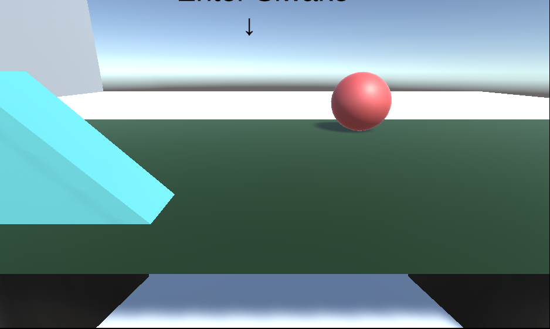

# Portfolio

- カトゥーン
- 連絡先 Email [dat.kato119@gmail.com](mailto:dat.kato119@gmail.com)
- 専門学校デジタルアーツ東京 ゲームプログラムコース 2025年卒業予定

## 資格
- 基本情報処理技術者試験4級合格

## スキル
- C#
  - 利用歴半年
- Unity
  - 利用歴半年
  - チーム作品の開発経験あり
- C
  - 利用歴半年
  - コンソールで簡単なデータ処理プログラムを開発

## 取り組んでいるテーマ
オリジナルゲーム開発

## 作品リスト

### 即死魔法少女(即魔女)

- ヤクザに倒されないように、ヤクザを倒す アクションシューティングゲーム(一撃死)

- 開発環境：Unity2021.3.4f1
- 開発期間：2023/9/8-11/11

### Siwake
[Siwake(Unityroom)](https://unityroom.com/games/siwake-sample)

- 丸以外の物をEnterを押してどかし仕分けるゲーム

- 開発環境 : Unity2021.3.4f1
- 開発期間 : 2023/12/23-12/26
- [一週間ゲームジャム参加(お題おくる)](https://unityroom.com/unity1weeks)
## 連絡先
- E-mail [dat.kato119@gmail.com](mailto:dat.kato119@gmail.com)