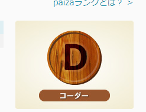

# 見出し1
## 見出し2
### 見出し3
**太字**

*斜体*

~~取り消し線~~

<s>取り消し線</s>

サブスクリプト

文字<sub>下付き文字。サブスクリプト<sub>

文字<sup>上付き文字。スパーサブスクリプト</sup>

>引用

コードの引用`Ctrl`+`E`

```cs
int a = 0;
Debug.Log(a);
```

[DATサイト](https://www.dat.ac.jp)
<a herf="https://www.dat.ac.jp">DATサイト</a>



- 箇条書き1
- 箇条書き2
- 箇条書き3
- aaaaaaaaaaaaaaaaaaaaaaaaaaaaaaaaaaaaaaaaaaaaaaaaaaaaaaaaaaaaaaaaaaaaaaaaaaaaaaaa

1. 番号1
2. 2番目
3. 3番目

- 入れ子
   - 入れ子
    - 入れ子3
   - 入れ子2
 - 入れ子1

 1. 数字入れ子
     1. 数字入れ子
        1. 数字入れ子
      1. 数字入れ子
 1. 数字入れ子

 - [] チャックボックス
 - [] チャックボックス2
 - [] チャックボックス3
 - [x] 完了

